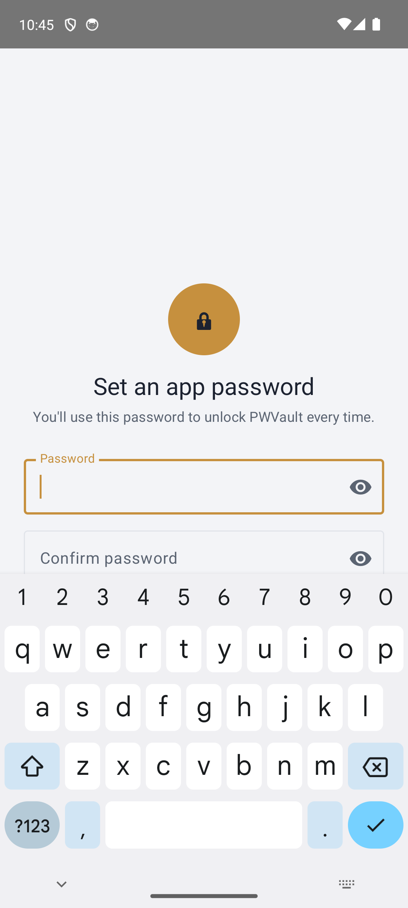
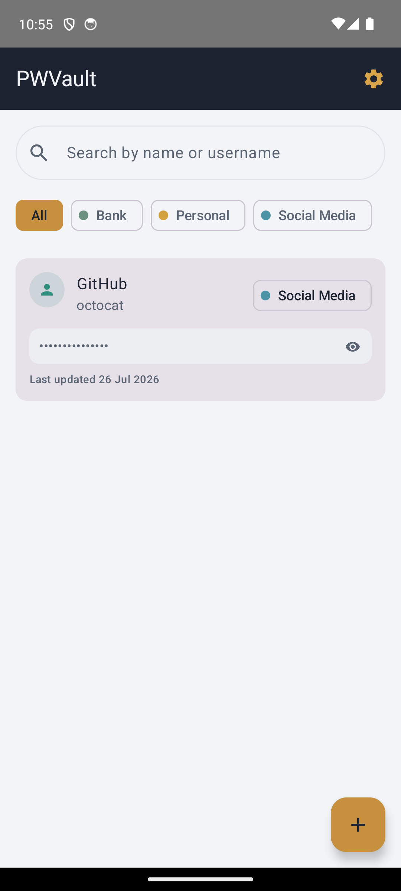
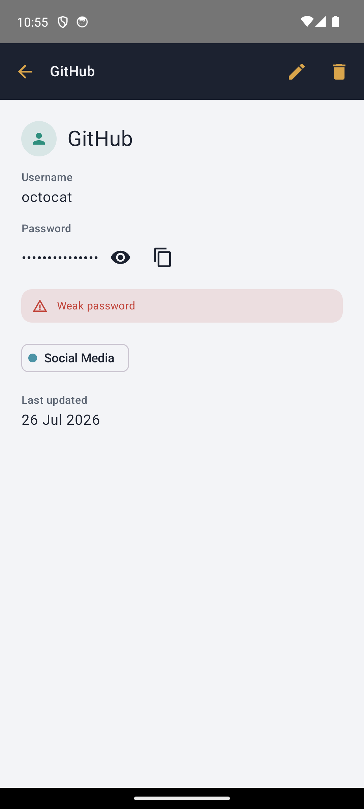
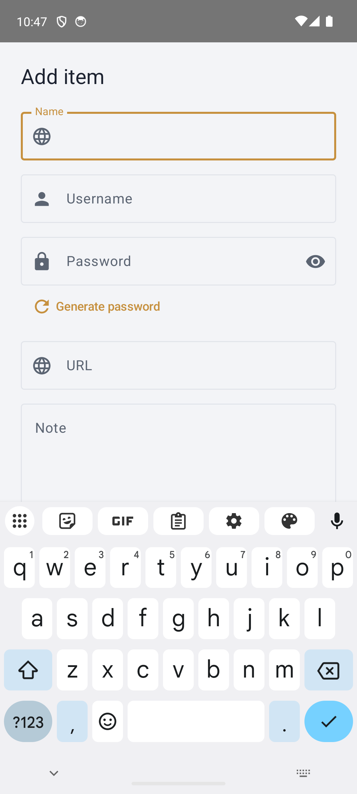
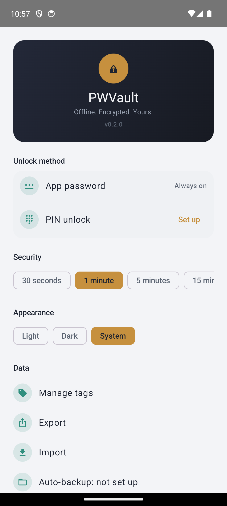

# PWVault

Ứng dụng Android quản lý mật khẩu cá nhân, chạy hoàn toàn offline. Dữ liệu mã hóa AES-256 (SQLCipher) ngay trên máy, không server, không đồng bộ cloud. Chi tiết xem [docs/overview.md](docs/overview.md) và [docs/architecture.md](docs/architecture.md).

**Trạng thái:** 16/16 roadmap item đã xong. Chi tiết: [docs/plans/roadmap.md](docs/plans/roadmap.md).

## Tính năng chính

- Mở khóa bằng Master Password, PIN số, hoặc sinh trắc học (vân tay/khuôn mặt).
- CRUD Vault Item, tìm kiếm, phân loại theo Tag.
- Sinh mật khẩu ngẫu nhiên.
- Import CSV/Excel; export mã hóa (`.pwvbackup`) hoặc CSV/Excel không mã hóa.
- Auto-backup nền (rotate 5 bản), cảnh báo mật khẩu yếu/trùng lặp, chặn chụp màn hình.

Danh sách đầy đủ: [docs/overview.md § Main Features](docs/overview.md#main-features).

## Tech Stack

| | |
|---|---|
| Ngôn ngữ | Kotlin 2.4.10 |
| UI | Jetpack Compose (Material 3) |
| Database | Room 2.8.4 + SQLCipher (AES-256) |
| KDF | Argon2id (`argon2kt`) |
| Bảo mật khóa | Android Keystore, `BiometricPrompt` |
| DI | Hilt |
| Background job | WorkManager |
| Import/Export | SAF, `zip4j`, `fastexcel-reader` |
| minSdk / targetSdk | 26 / 37 |

Quyết định kỹ thuật chi tiết: [docs/architecture.md](docs/architecture.md).

## Screenshots

| | | |
|---|---|---|
|  Setup |  Unlock |  List |
|  Chi tiết |  Thêm/sửa |  Cài đặt |

## Cài đặt (Download)

Tải bản mới nhất (debug-signed APK) tại [GitHub Releases](https://github.com/danhbuidcn/password-vault-android/releases/latest).

## Tài liệu dự án

- [docs/overview.md](docs/overview.md) — tổng quan nghiệp vụ
- [docs/functional-spec.md](docs/functional-spec.md) — spec nguồn
- [docs/architecture.md](docs/architecture.md) — kiến trúc & quyết định kỹ thuật (bao gồm [cấu trúc project](docs/architecture.md#project-structure))
- [docs/flow.md](docs/flow.md) — cơ chế hoạt động: vòng đời app, luồng mở khóa/khóa, luồng dữ liệu (CRUD, backup, import)
- [docs/glossary.md](docs/glossary.md) — thuật ngữ
- [docs/manifest.md](docs/manifest.md) — stack + rule load map cho `/code-plan`, `/code-guard`
- [docs/dev-setup.md](docs/dev-setup.md) — setup môi trường dev, chạy trên thiết bị thật/emulator, build APK
- [docs/plans/roadmap.md](docs/plans/roadmap.md) — trạng thái từng roadmap item
- [docs/plans/](docs/plans/) — implementation plan theo từng task
