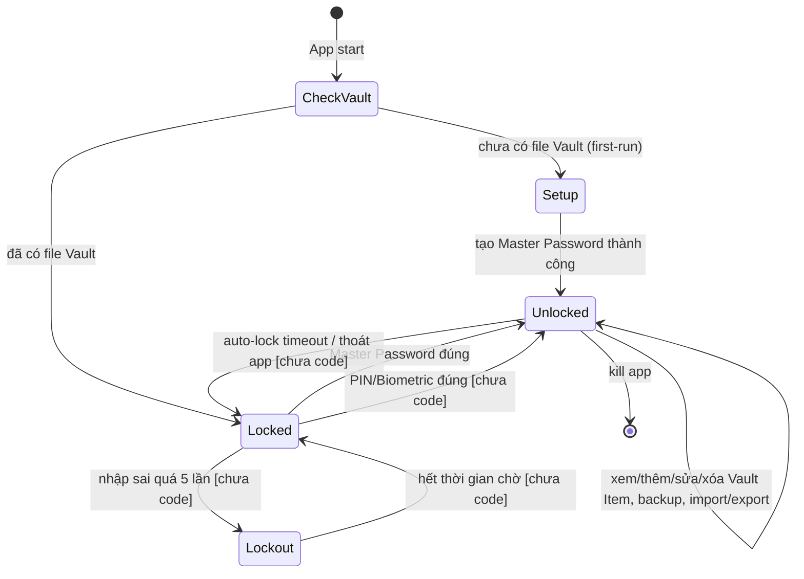
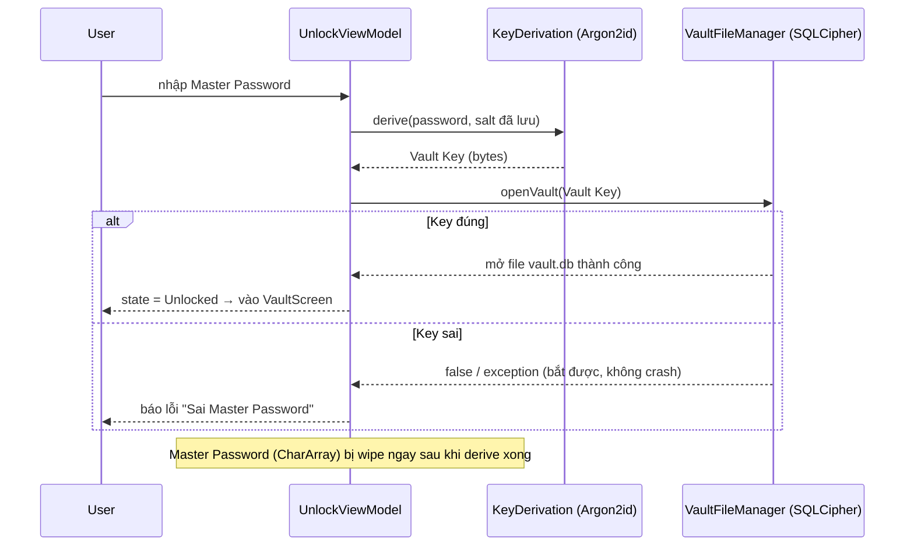
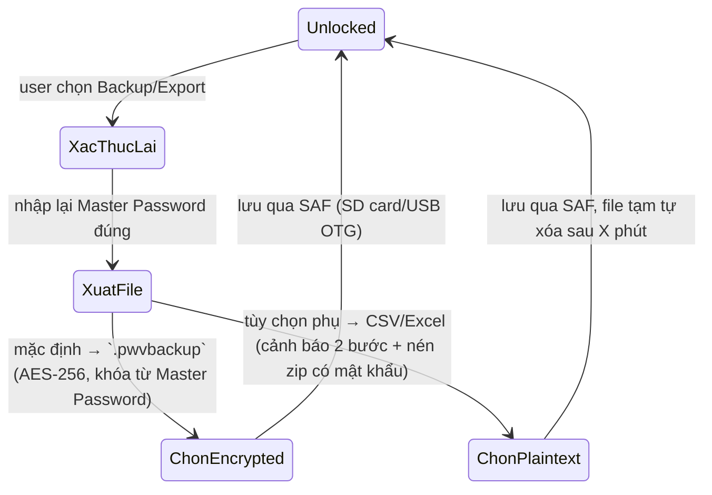

# Flow

## Summary

- Tài liệu mô tả **cơ chế hoạt động tổng thể** của pwvault-android: vòng đời app (state), luồng mở khóa/khóa, và luồng dữ liệu chính (CRUD, backup/restore, import).
- Bổ sung cho [overview.md](overview.md#main-workflow) (tóm tắt ngắn) và [architecture.md](architecture.md#authentication) (chi tiết bảo mật) — xem 2 file đó để biết business rule/tech stack đầy đủ.
- Đánh dấu rõ phần nào **đã code** và phần nào **còn là plan**, cập nhật lại khi có feature mới implement xong.

---

## App Lifecycle (state diagram)

- **Setup**: chỉ xảy ra đúng 1 lần (first-run). Sau khi tạo Vault, các lần mở app sau luôn bắt đầu từ `Locked`.
- **Lockout**: sau 5 lần ✅ nhập sai liên tiếp, khóa tạm thời tăng dần theo cấp số nhân: 30 giây, x2 mỗi lần sai tiếp theo, tối đa 30 phút ✅ — xem chi tiết ở [functional-spec.md §4](functional-spec.md#4-đăng-nhập--mở-khóa-app).
- **auto-lock timeout**: mặc định 1 phút không thao tác ✅, cho phép cấu hình — xem [functional-spec.md §4](functional-spec.md#4-đăng-nhập--mở-khóa-app).
- **Locked → Unlocked qua PIN/Biometric**, **Lockout**, **auto-lock**: mô tả theo plan, **chưa có code** — xem `docs/plans/roadmap.md` cho thứ tự implement.
- **Locked → Unlocked qua Master Password**: đã code, xem [feature-01-master-password-unlock-plan.md](plans/feature-01-master-password-unlock-plan.md).

---

## Luồng bảo mật khi Unlock (đã code — Feature 1)

Chi tiết tham số Argon2id (`m=64MB, t=3, p=1`), vị trí lưu salt/file Vault: xem [feature-01-master-password-unlock-plan.md](plans/feature-01-master-password-unlock-plan.md).

---

## Luồng dữ liệu chính (Vault Item CRUD)

> Trạng thái: **chưa code** (Feature 5 theo `docs/plans/roadmap.md`) — mô tả theo thiết kế đã chốt trong [overview.md](overview.md#main-workflow).

1. Sau khi `Unlocked`, `VaultScreen` load danh sách Vault Item qua Room (`Flow`, cập nhật realtime).
2. Thêm/sửa Vault Item (Login hoặc Note) → ghi qua Repository → Room DAO → SQLCipher DB.
3. Xóa Vault Item → tương tự, xóa thẳng trong DB mã hóa (không có thùng rác/soft-delete theo spec hiện tại).
4. Tìm kiếm/lọc theo tên, username, hoặc Tag — thực hiện trên dữ liệu đã giải mã trong bộ nhớ (Room trả về plaintext sau khi DB đã mở bằng đúng key).

---

## Luồng Backup / Restore

> Trạng thái: **chưa code** — mô tả theo [functional-spec.md §7](functional-spec.md).

**Restore** (đổi máy/khôi phục): cài app mới → `CheckVault` không thấy Vault → nhưng thay vì `Setup` tạo mới, user chọn **Import `.pwvbackup`** → nhập Master Password → derive lại Vault Key từ salt trong file backup → mở được → vào `Unlocked` với dữ liệu cũ.

---

## Luồng Import (CSV/Excel)

> Trạng thái: **chưa code** — mô tả theo [functional-spec.md §6](functional-spec.md).

1. User chọn file CSV/Excel qua SAF.
2. App đọc file, hiển thị màn map cột (tên ↔ username ↔ password ↔ URL...).
3. Phát hiện trùng lặp (so khớp username/tên có sẵn trong Vault) → cảnh báo, để user chọn bỏ qua/ghi đè/thêm mới.
4. Sau khi import xong, nhắc user xóa file nguồn nếu là plaintext.

---

## Trạng thái implement hiện tại (cập nhật khi có feature mới)

| Phần | Trạng thái |
|---|---|
| Setup (tạo Master Password + Vault) | ✅ Đã code (Feature 1, xem trạng thái chính thức ở roadmap) |
| Unlock bằng Master Password | ✅ Đã code (Feature 1, xem trạng thái chính thức ở roadmap) |
| VaultScreen | 🟡 Placeholder tĩnh, chưa có CRUD thật |
| Unlock bằng PIN | ⬜ Chưa code |
| Unlock bằng sinh trắc học | ⬜ Chưa code |
| Auto-lock timer | ⬜ Chưa code |
| Lockout khi nhập sai nhiều lần | ⬜ Chưa code |
| Vault Item CRUD (Room thật) | ⬜ Chưa code (Feature 5) |
| Backup/Export (`.pwvbackup`, CSV/Excel) | ⬜ Chưa code |
| Import (CSV/Excel) | ⬜ Chưa code |

Xem thứ tự implement đầy đủ ở [docs/plans/roadmap.md](plans/roadmap.md).

---

## Related Documents

- [overview.md](overview.md) — tổng quan nghiệp vụ
- [architecture.md](architecture.md) — kiến trúc & bảo mật chi tiết
- [functional-spec.md](functional-spec.md) — spec nguồn
- [plans/roadmap.md](plans/roadmap.md) — thứ tự implement feature
- [plans/feature-01-master-password-unlock-plan.md](plans/feature-01-master-password-unlock-plan.md)
