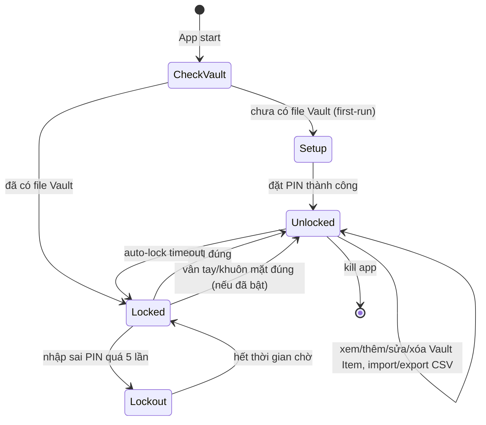
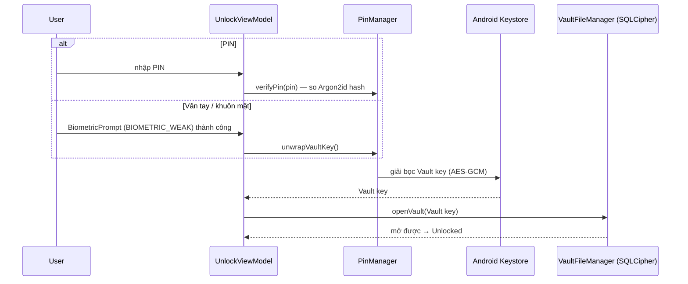
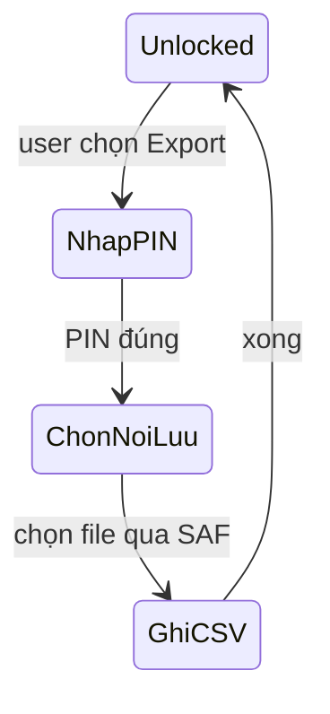

# Flow

## Summary

- Tài liệu mô tả **cơ chế hoạt động tổng thể** của pwvault-android: vòng đời app (state), luồng mở khóa/khóa, và luồng dữ liệu chính (CRUD, export/import CSV).
- Bổ sung cho [overview.md](overview.md#main-workflow) (tóm tắt ngắn) và [architecture.md](architecture.md#authentication) (chi tiết bảo mật) — xem 2 file đó để biết business rule/tech stack đầy đủ.

---

## App Lifecycle (state diagram)

```mermaid
stateDiagram-v2
    [*] --> CheckVault: App start

    CheckVault --> Setup: chưa có file Vault (first-run)
    CheckVault --> Locked: đã có file Vault

    Setup --> Unlocked: đặt PIN thành công

    Locked --> Unlocked: PIN đúng
    Locked --> Unlocked: vân tay/khuôn mặt đúng (nếu đã bật)
    Locked --> Lockout: nhập sai PIN quá 5 lần
    Lockout --> Locked: hết thời gian chờ

    Unlocked --> Locked: auto-lock timeout
    Unlocked --> Unlocked: xem/thêm/sửa/xóa Vault Item, import/export CSV

    Unlocked --> [*]: kill app
```

- **Setup**: chỉ 1 lần (first-run). User đặt PIN số (≥4) — mật khẩu duy nhất cần nhớ.
- **Lockout**: sau 5 lần sai liên tiếp, khóa tạm thời 30 giây, x2 mỗi lần sai tiếp, tối đa 30 phút — xem [functional-spec.md §4](functional-spec.md#4-đăng-nhập--mở-khóa-app).
- **Vault cũ chưa có PIN** (tạo trước Feature 19 bằng Master Password): `Locked` hiện màn Master Password 1 lần → `Unlocked` → bắt buộc đặt PIN.

---

## Luồng bảo mật khi Unlock (Feature 19)

```mermaid
sequenceDiagram
    participant U as User
    participant VM as UnlockViewModel
    participant PM as PinManager
    participant KS as Android Keystore
    participant VF as VaultFileManager (SQLCipher)

    alt PIN
        U->>VM: nhập PIN
        VM->>PM: verifyPin(pin) — so Argon2id hash
    else Vân tay / khuôn mặt
        U->>VM: BiometricPrompt (BIOMETRIC_WEAK) thành công
        VM->>PM: unwrapVaultKey()
    end
    PM->>KS: giải bọc Vault key (AES-GCM)
    KS-->>VM: Vault key
    VM->>VF: openVault(Vault key)
    VF-->>VM: mở được → Unlocked
```

- Vault key: 32 byte ngẫu nhiên, sinh lúc setup, không dẫn xuất từ mật khẩu nào.
- Sinh trắc học chỉ là cổng xác nhận (không `CryptoObject`), để khuôn mặt loại "yếu" cũng dùng được.
- Chi tiết: [feature-19-simplify-unlock-csv-plan.md](plans/feature-19-simplify-unlock-csv-plan.md).

---

## Luồng dữ liệu chính (Vault Item CRUD)

1. Sau khi `Unlocked`, `VaultScreen` load danh sách Vault Item qua Room (`Flow`, cập nhật realtime).
2. Thêm/sửa Vault Item (Login hoặc Note) → Repository → Room DAO → SQLCipher DB.
3. Xóa Vault Item → xóa thẳng trong DB mã hóa (không có thùng rác).
4. Tìm kiếm/lọc theo tên, username, Tag — trên dữ liệu đã giải mã trong bộ nhớ.

---

## Luồng Export / chuyển máy (CSV)

```mermaid
stateDiagram-v2
    Unlocked --> NhapPIN: user chọn Export
    NhapPIN --> ChonNoiLuu: PIN đúng
    ChonNoiLuu --> GhiCSV: chọn file qua SAF
    GhiCSV --> Unlocked: xong
```

- File CSV **không mã hóa**: cột Name, Username, Password, URL, Note, Tags, CustomFields, Type.
- Không còn auto-backup và `.pwvbackup` (Feature 19).
- **Chuyển máy**: cài app mới → đặt PIN → Import file CSV.

---

## Luồng Import (CSV/Excel)

1. User chọn file CSV/Excel qua SAF.
2. App đọc file, tự map cột theo header (header của app, hoặc tên phổ biến như `title`, `login`, `uri`, `notes`); user vẫn sửa được.
3. File export của app: khôi phục thêm loại item (Type), Tag (tạo mới nếu chưa có), Custom Field.
4. Phát hiện trùng lặp (so tên + username có sẵn) → cảnh báo trước khi import.

Xem thứ tự/trạng thái implement ở [docs/plans/roadmap.md](plans/roadmap.md).

---

## Related Documents

- [overview.md](overview.md) — tổng quan nghiệp vụ
- [architecture.md](architecture.md) — kiến trúc & bảo mật chi tiết
- [functional-spec.md](functional-spec.md) — spec nguồn
- [plans/roadmap.md](plans/roadmap.md) — thứ tự implement feature
- [plans/feature-01-master-password-unlock-plan.md](plans/feature-01-master-password-unlock-plan.md)
